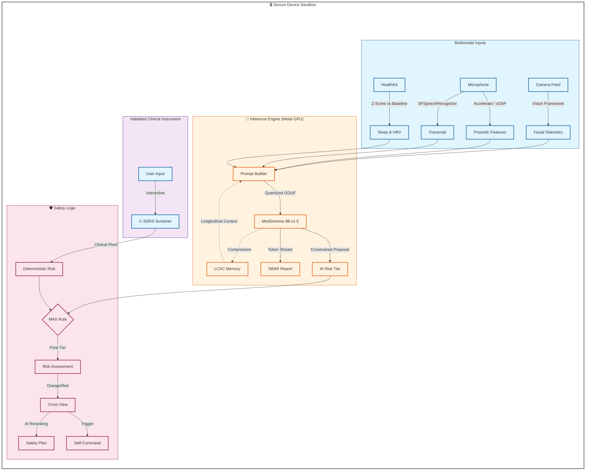

# Sentinel — Architecture & Technical Overview

> On-device clinical AI for veteran crisis intervention, powered by MedGemma.

# System Architecture


## Table of Contents

1. [System Overview](#system-overview)
2. [Edge-Optimized Inference Architecture](#edge-optimized-inference-architecture)
3. [MedGemma Integration — Six Core Capabilities](#medgemma-integration--six-core-capabilities)
4. [Privacy-First Design](#privacy-first-design)
5. [Multimodal Behavioral Telemetry Pipeline](#multimodal-behavioral-telemetry-pipeline)
6. [Risk Tier System & Crisis Intervention](#risk-tier-system--crisis-intervention)
7. [Key Architectural Decisions](#key-architectural-decisions)
8. [Directory Structure](#directory-structure)

## System Overview

Sentinel is a SwiftUI iOS application designed for veteran suicide prevention and crisis intervention. It performs **real-time, on-device clinical AI inference** using a quantized MedGemma large language model — with zero cloud dependency. The system integrates multimodal behavioral telemetry (face tracking, voice prosody, speech transcription), Apple HealthKit biometrics, and the validated Columbia Suicide Severity Rating Scale (C-SSRS) to produce clinically-grounded risk assessments entirely on the user's device.

### Core Design Philosophy

Every architectural decision in Sentinel was driven by three constraints:

1. **Edge-first** — All inference runs on-device via Metal GPU acceleration. No network calls, no cloud APIs, no data leaves the phone.
2. **Clinical safety** — Deterministic fallbacks exist at every layer. The system never depends solely on LLM output for life-critical risk classification.
3. **Veteran-centered UX** — Military-informed design language ("tactical assets", "battle buddy", "extraction", "mission critical") built for users who respond to this framing.

---

## Edge-Optimized Inference Architecture

Running a 4-billion parameter medical LLM on a mobile device required deliberate engineering at every layer of the stack.

### 4-Bit Quantized Model Selection

Sentinel uses **`medgemma-1.5-4b-it.Q4_K_M.gguf`** — a 4-bit quantized, instruction-tuned variant of Google's MedGemma. The Q4_K_M quantization scheme was chosen for its optimal balance of model quality and memory footprint on iOS devices:

- **Q4_K_M** retains higher precision on attention and feed-forward layers most critical for clinical reasoning, while aggressively quantizing less sensitive weights.
- The 4B parameter count fits within the memory envelope of modern iPhones (6GB+ RAM) when fully offloaded to the GPU.
- Instruction-tuning ensures the model follows structured clinical prompt formats (risk tiers, SBAR sections, reranking orders) without extensive few-shot examples consuming context window.

### Custom llama.cpp Fork for GPU Offload

The stock `LLM.swift` library (eastriverlee/LLM.swift) did not expose the `n_gpu_layers` parameter needed for Metal GPU offloading. Sentinel includes a **local Swift package (`GPUEnabledLLM`)** that wraps a forked version of the library to surface this critical parameter.

```
LocalPackages/
├── GPUEnabledLLM/          ← Custom fork exposing n_gpu_layers
│   ├── Sources/GPUEnabledLLM/
│   │   ├── GPUEnabledLLM.swift    (MetalAccelerator + device-aware presets)
│   │   └── LLMFork.swift          (Patched LLM wrapper with GPU layer control)
│   └── Package.swift
└── LLM.swift/              ← llama.cpp xcframework (C++ inference backend)
```

**`MetalAccelerator`** provides device-aware GPU configuration:

| Preset | GPU Layers | Context Window | Target |
|---|---|---|---|
| `maxGPU` | 999 | 1024 | 6GB+ RAM (iPhone 15 Pro+) |
| `balanced` | 32 | 512 | 4GB+ RAM |
| `lowMemory` | 16 | 256 | Older devices |
| `cpuOnly` | 0 | 2048 | Fallback |

Production configuration uses **`maxGPU`** — all 999 transformer layers offloaded to the Metal GPU, achieving **5-10x speedup** over CPU-only inference (from 10-30s down to 1-5s per generation).

### Inference Parameter Tuning for Mobile

LLM generation parameters were tuned specifically for on-device clinical use:

| Parameter | Value | Rationale |
|---|---|---|
| Temperature | **0.1** | Near-deterministic output for clinical consistency; also reduces sampling computation |
| Context window | **1024** | Reduced from default to minimize KV-cache memory pressure on device |
| Max tokens | **512** | Bounded output length prevents runaway generation |
| topK | **40** | Moderate vocabulary filtering |
| topP | **0.95** | Nucleus sampling with clinical conservatism |
| GPU layers | **999** | Full Metal offload for maximum throughput |

### Token Streaming for Report Generation

SBAR clinical report generation uses **real-time token streaming** via `llm.core.generateResponseStream`, returning an `AsyncStream<String>` that feeds tokens directly to the UI as they are generated. This provides:

- **Immediate visual feedback** — the user sees the report building word-by-word rather than waiting for full generation.
- **Early termination** — the stream monitors for a `<<END_OF_REPORT>>` stop sequence and RECOMMENDATION section completion, halting inference as soon as the clinical content is complete.
- **Timeout resilience** — a 10-second first-token timeout detects model stalls and falls back to a template-based `SBARGenerator`.
- **Output capping** — a 3,000-character ceiling prevents runaway generation from consuming device resources.

### iOS Vision Framework for Behavioral Telemetry

Rather than shipping a separate face-analysis ML model, Sentinel uses Apple's **built-in Vision framework** (`VNDetectFaceLandmarksRequest`, revision 3) for real-time facial behavioral telemetry. This is a deliberate edge optimization:

- **Zero additional model weight** — Vision runs on the Apple Neural Engine, sharing no GPU memory with MedGemma.
- **Hardware-accelerated** — Apple's neural engine handles face detection at native speed with no model loading overhead.
- **Throttled to ~2 FPS** — frames are sampled at approximately 2 frames per second via `CFAbsoluteTime` comparison, balancing telemetry granularity against battery and thermal budget.

Three signals are extracted per frame: eye openness (alertness proxy), gaze deviation (engagement proxy), and head pitch (postural stability proxy). Only numerical float values are captured — **no images are ever stored**.

### Accelerate Framework for Voice Prosody

Voice prosodic features are extracted in real-time using Apple's **Accelerate/vDSP framework** rather than a dedicated speech ML model:

- **RMS energy** via `vDSP_rmsqv` — vocal intensity tracking
- **Pitch estimation** via autocorrelation with `vDSP_dotpr` — fundamental frequency in the 80-400Hz range
- **Pause detection** — state machine with -40dB silence threshold and 0.3s minimum pause duration

This produces clinical voice features (mean/std pitch, energy, speech rate, pause patterns, SNR) using hardware-accelerated DSP — no additional ML model required.

### iOS Glass Material Effects

Sentinel uses iOS `ultraThinMaterial` glass effects for modal overlays, including the risk state overlay and the crisis recheck overlay. The tab bar uses `UIBlurEffect(style: .systemUltraThinMaterialDark)` for a translucent glass aesthetic. These leverage iOS's built-in compositor for GPU-efficient blur without custom shader overhead.

### Timeout Architecture

Every LLM inference call is wrapped in a structured concurrency timeout via a `withTimeout()` utility (using `withThrowingTaskGroup` to race inference against a sleep timer):

| Operation | Timeout | Fallback |
|---|---|---|
| Risk assessment | 60s | Deterministic C-SSRS scoring |
| Narrative compression | 30s | Skip compression, retain previous state |
| Safety plan reranking | 15s | Rule-based section ordering by primary driver |
| SBAR first token | 10s | Template-based `SBARGenerator` |
| HealthKit data fetch | 5s | Proceed without health data |

No LLM call can block the UI indefinitely. The system always degrades gracefully to deterministic behavior.

---

## MedGemma Integration — Six Core Capabilities

MedGemma is used across six distinct clinical AI tasks within Sentinel, each with its own prompt template, parsing strategy, and fallback path.

### 1. Unstructured Medical Record Ingestion (FHIR Simulator)

**Problem:** Veterans may have prior clinical history (e.g., VA discharge summaries) that should inform ongoing risk assessment, but these documents arrive as unstructured text.

**Solution:** `ClinicalDocumentManager` scans the app's Documents directory for synthetic discharge summaries in a simplified FHIR format (`{text: {div: "..."}}`) at app launch. The pipeline:

1. **Scan** — discover `synthetic_discharge_summary.json` files in Documents
2. **Parse** — extract text from FHIR-like JSON structure via Codable
3. **Strip** — remove HTML tags from the `div` content
4. **Archive** — move processed files to `Processed_Clinical_Docs/` to prevent reprocessing
5. **Ingest** — feed cleaned text to MedGemma via the `contextIngestion` prompt, which instructs the model to integrate the new clinical history into the existing longitudinal narrative

This allows the LLM to incorporate prior hospitalizations, diagnoses, and treatment history into future risk assessments without requiring structured EHR integration.

### 2. Longitudinal Clinical State Compression (LCSC)

**Problem:** Feeding raw historical check-in data to a 1024-token context window is infeasible. But clinical risk assessment requires longitudinal awareness.

**Solution:** LCSC is a **semantic compression pipeline** that maintains a rolling clinical narrative across check-ins:

- After each check-in, `LCSCManager` updates deterministic state: check-in count, trajectory (stable/improving/worsening), primary driver (sleep/activity/hrv/mood/cssrs/combined), crisis frequency, and days since last crisis.
- MedGemma then runs the `compression` prompt, which takes the previous narrative, the latest risk tier, transcript, and sleep data, and produces a compressed clinical summary that replaces the previous narrative.
- The compressed narrative persists in `LCSCState` (UserDefaults) and is injected into future risk assessment prompts as `{{HISTORY_CONTEXT}}`.

This gives MedGemma longitudinal awareness across an arbitrary number of check-ins while staying within the mobile context window budget.

### 3. Multimodal Risk Tier Analysis

**Problem:** Determine whether a veteran is in crisis using heterogeneous, multimodal signals.

**Solution:** The `riskAssessment` prompt template consolidates all signals into a single structured prompt:

| Placeholder | Data Source |
|---|---|
| `{{HISTORY_CONTEXT}}` | LCSC compressed clinical narrative |
| `{{HEALTH_SUMMARY}}` | HealthKit z-score deviations (sleep, HRV, steps) |
| `{{TRANSCRIPT}}` | On-device speech-to-text transcription |
| `{{VOICE_ANALYSIS}}` | Prosodic features from Accelerate/vDSP |
| `{{BEHAVIORAL_TELEMETRY}}` | Vision framework face telemetry report |
| `{{CSSRS_SUMMARY}}` | C-SSRS questionnaire responses |
| `{{VIGILANCE_NOTE}}` | LCSC risk modifiers (worsening trajectory, recent crises) |
| `{{SIGNAL_DISCREPANCY}}` | Cross-modal discrepancy detection results |

MedGemma outputs a risk tier (green/yellow/orange/red) and 1-2 sentence clinical reasoning. The `MedGemmaParser` uses a multi-strategy extraction pipeline (first-line color word → keyword scan → risk phrases → legacy JSON) to handle the variability of quantized model output.

**Critical safety constraint:** The final risk tier is always `max(C-SSRS deterministic tier, MedGemma probabilistic tier)`. The LLM can only escalate risk, never override a positive C-SSRS screen.

### 4. Risk Tier Explainer

**Problem:** When a veteran sees an elevated risk tier, they need to understand *why* — in accessible, non-clinical language.

**Solution:** The `explainRisk` prompt takes the current risk level, identified risk factors, health context, time since last check-in, and data sources, and generates a 2-sentence explanation. The parser enforces the 2-sentence maximum by truncation, ensuring explanations remain concise and non-overwhelming.

This powers the "flip card" interaction on the Command dashboard — the user sees their risk tier on the front, taps to flip, and reads the AI-generated explanation on the back.

### 5. Safety Plan Section Reranking

**Problem:** The Stanley-Brown Safety Plan has 7 sections. During a crisis, which sections should the veteran see *first*?

**Solution:** The `rerankSafetyPlan` prompt provides MedGemma with the current trajectory, primary driver, risk tier, detected patterns, and clinical narrative, then asks it to output a permutation of section numbers 1-7 ordered by clinical relevance.

The output is validated as a legal permutation (exactly 7 unique digits in range 1-7). If validation fails, the system falls back to `SafetyPlanSection.fallbackOrder(for: driver)` — a deterministic ordering based on the LCSC primary driver:

- **sleep** driver → coping strategies prioritized
- **cssrs** driver → professional contacts prioritized
- **default** → lethal means restriction first (evidence-based default)

During crisis, the top 3 reranked sections auto-expand in the `RedTierCrisisView`.

### 6. SBAR Clinical Report Generation

**Problem:** Generate a clinical handoff report suitable for sharing with a provider, formatted in the standard SBAR (Situation, Background, Assessment, Recommendation) structure used in healthcare.

**Solution:** The `report` prompt template generates a four-section SBAR report with token streaming. The system adapts content based on recipient type:

- **Primary Care** — emphasizes biometric trends and longitudinal context
- **Mental Health** — emphasizes C-SSRS responses and behavioral patterns
- **Emergency Services** — emphasizes immediate safety status and crisis history
- **Caregiver** — emphasizes practical safety steps and support actions

Streaming tokens flow directly to the UI, with `<<END_OF_REPORT>>` stop sequence detection and RECOMMENDATION section completion monitoring for early termination. A template-based `SBARGenerator` serves as the deterministic fallback if the LLM stalls or is unavailable.

---

## Privacy-First Design

Privacy is not a feature of Sentinel — it is a foundational architectural constraint that shaped every technical decision.

### Zero Cloud Architecture

Sentinel makes **zero network API calls** for any clinical function. The entire AI pipeline — inference, compression, report generation, risk analysis — runs on-device via llama.cpp compiled to the Metal GPU backend. There is no analytics SDK, no telemetry endpoint, no crash reporting service, and no remote configuration.

### No Image Storage from Camera

The camera captures facial telemetry as **numerical float values only** — eye openness ratios, gaze deviation angles, and head pitch degrees. The raw camera frames are processed by the Vision framework in real-time and immediately discarded. No pixel data is ever written to disk or stored in memory beyond the current frame's processing cycle.

### Local-Only Persistence

All data persistence uses two on-device mechanisms:

- **SwiftData** — for structured clinical records (`CheckInRecord`, `FacialBiomarkers`, `AudioMetadata`)
- **UserDefaults + JSON** — for domain objects (`SafetyPlan`, `UserProfile`, `LCSCState`, `CrisisHistory`, `HopeBox`)

Both are sandboxed to the app's container with iOS file-level encryption at rest (NSFileProtectionComplete by default).

### Complete Data Purge

`MissionProfileViewModel.purgeAllData()` provides a **single-action complete data destruction** mechanism that:

1. Clears all UserDefaults keys (profile, safety plan, LCSC state, crisis history, hope box)
2. Recursively deletes the entire Documents directory (media files, processed clinical documents, GGUF model cache)

This gives the veteran full control over their data lifecycle — if they want everything gone, one tap removes all traces.

### Biometric Lock

The app uses `LocalAuthentication` (Face ID / Touch ID) to lock the interface when backgrounded. The onboarding flow explicitly communicates the privacy model to the user: on-device AI, no cloud, encrypted local storage. Biometric auth is offered during onboarding but can be skipped.

### iCloud Backup Exclusion

Profile settings include an option to exclude app data from iCloud backups, preventing clinical data from being synced to Apple's cloud infrastructure.

### 30-Day Crisis History Retention

Crisis resolution records are automatically purged after 30 days, limiting the temporal window of sensitive crisis data stored on device. The LCSC state also resets after 30 days of inactivity.

---

## Multimodal Behavioral Telemetry Pipeline

Sentinel's check-in process captures three simultaneous data streams during a 30-second recording window:

### Visual Channel (Vision Framework)

`CameraService` runs `VNDetectFaceLandmarksRequest` on the front-facing camera at ~2 FPS, extracting per-frame `FaceTelemetry` structs containing:
- **Eye openness** — left eye bounding box height from landmarks (alertness proxy)
- **Gaze deviation** — pupil offset from eye center (engagement proxy)
- **Head pitch** — face observation rotation angles (postural stability proxy)

`VisualScribe` then generates a behavioral telemetry report by splitting the time-series into early/mid/late temporal segments and analyzing postural stability (head pitch slope), gaze regulation (deviation trend), and alertness (eye openness decline). It assesses overall regulation pattern (multi-signal decompensation vs. regulated).

### Audio Channel (Accelerate + Speech)

- **Speech-to-text** via `SFSpeechRecognizer` — on-device transcription of the veteran's verbal response
- **Prosodic analysis** via `ProsodyAnalyzer` (vDSP) — pitch mean/std, energy mean/std, speech rate, pause count/duration, speech percentage, signal-to-noise ratio

### HealthKit Channel

`HealthKitManager` fetches 30-day rolling baselines and current readings for sleep (total hours, stages, timing), activity (steps, calories, distance, exercise minutes), and heart rate variability (SDNN). Z-score deviations are computed against the personal baseline — a z-score below -1.5 is "concerning", below -2.0 is "significant".

### Cross-Modal Discrepancy Detection

`DiscrepancyDetector` identifies clinically significant mismatches between verbal and nonverbal signals:

- **MASKING** — positive verbal content paired with flat vocal prosody (pitch variability < 15, energy < -30dB)
- **CONCORDANT DECOMPENSATION** — slow speech rate combined with postural decline
- **AVOIDANCE PATTERN** — gaze avoidance combined with excessive speech pauses (>6)

These discrepancy notes are injected into the MedGemma risk assessment prompt as `{{SIGNAL_DISCREPANCY}}`, giving the model cross-modal awareness that a single modality alone would miss.

---

## Risk Tier System & Crisis Intervention

### Four-Tier Risk Model

| Tier | Color | Trigger | Response |
|---|---|---|---|
| **Low** | Green | All C-SSRS negative, no significant deviations | Standard check-in complete |
| **Moderate** | Yellow | C-SSRS Q1/Q2 positive or moderate AI assessment | Guided coping strategies |
| **High Monitoring** | Orange | C-SSRS Q3/Q6 positive or high AI assessment | Full-screen monitoring overlay |
| **Crisis** | Red | C-SSRS Q4/Q5 positive or AI crisis classification | Full-screen crisis intervention |

### Parallel AI + Deterministic Pipeline

MedGemma inference starts in a background `Task` **in parallel** with the C-SSRS questionnaire — the veteran answers screening questions while the LLM processes multimodal signals. This design:

1. Eliminates sequential wait time (AI runs while user completes C-SSRS)
2. Provides immediate crisis escalation from C-SSRS (Q4/Q5 positive = instant crisis tier, no LLM wait)
3. Combines both signals via `max(deterministic, probabilistic)` — the LLM can only escalate, never downgrade a positive C-SSRS screen

### Red Tier Crisis View

When crisis tier activates, `RedTierCrisisView` overlays the entire tab interface at `zIndex(100)`, blocking all other interaction. It presents:

1. **Auto-playing self-command briefing** — a video the veteran pre-recorded during a stable period, speaking to their future crisis self
2. **Tactical assets** — reinforcement photos and videos from the Hope Box
3. **AI-reranked safety plan** — all 7 Stanley-Brown sections, reordered by MedGemma based on clinical context, with the top 3 auto-expanded
4. **Battle buddy section** — pinned contact for peer support
5. **988 Suicide & Crisis Lifeline** — direct call button
6. **10-minute countdown timer** — triggers a recheck prompt

### Crisis State Machine

The crisis follows a state machine: `active` → `recheck` → `stabilizing`/`resolved`. After 10 minutes, the recheck overlay (using iOS glass material blur) presents three options:

- **More Stable** — resolves crisis, exits overlay
- **About the Same** — resets 10-minute timer for another holding period
- **Still Not Safe** — escalates to 988 call sheet

---

## Key Architectural Decisions

### Lazy Onboarding with Deferred Safety Plan

Sentinel uses a **lazy onboarding** pattern — the initial onboarding flow is deliberately minimal (welcome screen + biometric setup only). The safety plan, which requires significant user input (contacts, coping strategies, environment safety steps), is **deferred until after onboarding** rather than gating first use on plan completion.

Post-onboarding, a `SetupNudgeOverlay` presents a bouncing arrow animation pointing to the Safety Plan tab, gently guiding the veteran to complete their plan without blocking access to the app. If the safety plan is already set up but no check-in has been performed, the nudge redirects to the Command tab instead.

This decision was driven by two insights:
1. **Friction kills adoption** — veterans in need are unlikely to complete a 7-section safety plan before they can use the app.
2. **Progressive engagement** — letting the user experience a check-in first builds trust and motivation to complete the safety plan.

### Actor Isolation for Thread Safety

All services that touch shared mutable state are implemented as Swift `actor` types: `MedGemmaEngine`, `MedGemmaModelManager`, `MedGemmaContextManager`, `HealthKitManager`, `NotificationManager`, `ClinicalDocumentManager`, `RiskAssessmentManager`. All ViewModels are `@MainActor`. This eliminates data races without manual lock management.

### Dual Persistence Strategy

- **SwiftData** for relational clinical records (`CheckInRecord` with related `FacialBiomarkers` and `AudioMetadata`) — benefits from relational modeling, efficient queries, and `externalStorage` for large binary data (512-dimensional Vision Feature Print embeddings).
- **UserDefaults + JSON** for simpler domain objects (`SafetyPlan`, `UserProfile`, `LCSCState`, `HopeBox`) — whole-object Codable serialization without the overhead of a relational store.

### Multi-Strategy LLM Output Parsing

Quantized models produce variable output formats. `MedGemmaParser` uses a 4+ strategy cascade to reliably extract risk tiers:

1. Check first line for color word (green/yellow/orange/red)
2. Scan full content for tier keywords
3. Match risk phrases ("high risk", "imminent risk")
4. Legacy JSON fallback

Additionally, `MedGemmaModelManager.cleanOutput()` truncates at stop markers (`<end_of_turn>`, `<<END_OF_REPORT>>`, hallucinated `user:`/`model:` turns) — addressing a known issue where quantized models generate stop tokens but the engine continues generating.

### Deterministic Fallback at Every Layer

Every MedGemma capability has a deterministic fallback:

| Capability | Fallback |
|---|---|
| Risk assessment | C-SSRS weighted scoring + HealthKit z-scores |
| SBAR generation | Template-based `SBARGenerator` |
| Safety plan reranking | Rule-based `fallbackOrder(for: driver)` |
| Narrative compression | Previous narrative retained unchanged |
| Risk explanation | Static tier description |

The system is designed to be **fully functional without the LLM loaded**. MedGemma enhances clinical reasoning — it never gates it.

### Stanley-Brown Safety Plan with OCR Intake

Veterans who already have a paper Stanley-Brown Safety Plan worksheet (the standard-of-care in VA settings) can scan it using `SafetyPlanOCRService`, which uses Vision's `VNRecognizeTextRequest` at `.accurate` recognition level. The OCR parser identifies 7 sections via keyword markers, extracts contacts with phone number regex, and distinguishes professional from social contacts. This reduces data entry friction for veterans transitioning from paper-based care.

### Hope Box with Self-Command Briefings

The Hope Box stores media the veteran curates during stable periods for use during crisis:

- **Self-command briefing** — a video recorded by the veteran speaking to their future crisis self, auto-played in `RedTierCrisisView`
- **Battle buddy briefing** — optional video from a trusted peer
- **Reinforcements** — photos, videos, and photo collections that provide emotional grounding

Media is stored in `Documents/HopeBox/` with file paths persisted in UserDefaults.

### Tactical Design System

The UI uses a military-inspired dark theme (`Theme.swift`) with tactical naming conventions:

- `TacticalBackground` / `TacticalSurface` / `TacticalSurfaceHover` for dark chrome
- `SentinelPrimary` (teal), `SentinelRed` (emergency), `SentinelYellow` / `SentinelOrange` for risk tiers
- Typography and Spacing constants for consistent sizing
- Boot-sequence loading animation: "ESTABLISHING SECURED PERIMETER", "VERIFYING ON-DEVICE INTEGRITY", "INITIALIZING MED-GEMMA ENGINE", "LOCAL ENCRYPTION ACTIVE"

This design language was chosen to resonate with veterans who respond to mission-oriented framing.

---

## Directory Structure

```
Sentinel/
├── SentinelApp.swift                        App entry, model loading, onboarding gate
├── ContentView.swift                        Main tab interface, SBAR streaming, risk overlays
├── Managers/
│   ├── CheckInSubmissionManager.swift       Orchestrates check-in save + LCSC update
│   ├── LCSCManager.swift                    Longitudinal state tracking + trajectory
│   ├── NotificationManager.swift            Local notification scheduling
│   └── RiskAssessmentManager.swift          Final risk tier determination
├── Models/
│   ├── Domain/                              Core domain types (RiskTier, SafetyPlan, etc.)
│   ├── HealthData/                          HealthKit metric structs
│   └── Responses/                           MedGemma response parsing types
├── Services/
│   ├── AI/                                  MedGemma engine, model manager, prompts, parser
│   ├── Analysis/                            C-SSRS, discrepancy detection, visual scribe
│   ├── Audio/                               Audio capture + prosody analysis
│   ├── Camera/                              Vision framework face telemetry
│   ├── HealthKit/                           Sleep, activity, vital health services
│   ├── Ingestion/                           FHIR clinical document processing
│   ├── OCR/                                 Safety plan worksheet scanning
│   ├── Reporting/                           SBAR template generator
│   └── Storage/                             LocalStorage (UserDefaults + JSON)
├── Utilities/
│   ├── Constants/                           Configuration, C-SSRS questions, prompts
│   ├── DesignSystem/                        Typography, spacing
│   ├── Domain/                              Risk calculation, trajectory, driver ID
│   └── Extensions/                          Formatting helpers
├── ViewModels/                              @MainActor VMs for each feature area
├── Views/
│   ├── CheckIn/                             Multimodal recording + C-SSRS flow
│   ├── Components/                          Shared UI components
│   ├── Crisis/                              RedTierCrisisView + recheck + escalation
│   ├── HopeBox/                             Media gallery + briefing recorder
│   ├── Onboarding/                          Welcome, biometrics, setup nudge
│   ├── Profile/                             Mission profile + data purge
│   └── SafetyPlan/                          Plan display, wizard, OCR intake
└── Resources/
    ├── Models/                              GGUF model files
    └── Samples/                             Sample data

LocalPackages/
├── GPUEnabledLLM/                           Custom fork exposing Metal GPU layers
└── LLM.swift/                               llama.cpp xcframework backend
```
